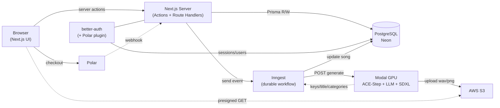
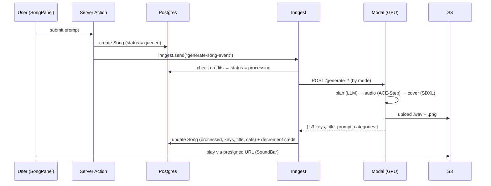
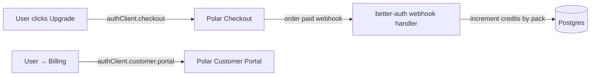
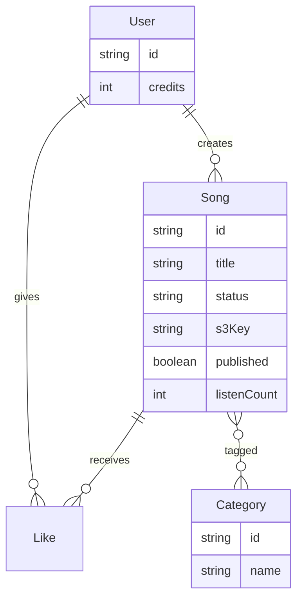

# Dhun AI 🎵

> Text in, a full studio-quality song out — in seconds.

I built **Dhun AI** to answer a simple question I kept coming back to: *what if writing a song was as easy as describing it?* You type a vibe — "a nostalgic 1950s crooner ballad about a rainy Tuesday" — and a few moments later you're listening to an original track, cover art and all. This repo is the web app I built around that idea: the UI, the auth, the payments, and the async pipeline that turns a prompt into music.

---

## Why I built it

I wanted to go beyond a toy "call an API and show the result" demo and actually build the hard parts of a real product:

- **Long-running AI jobs** that don't fit in a single request (music generation takes real GPU time), so I needed a durable, retryable pipeline instead of a hanging HTTP call.
- **A real credits + payments loop** so usage is metered and monetizable.
- **A polished, themeable player experience** — not just a download link, but a proper "now playing" bar, a discover feed, likes, and publishing.

So Dhun AI became my playground for wiring together a modern full-stack app with a serverless GPU backend.

---

## What it can do

- 🎼 **Generate songs from a prompt** — three modes: describe the whole song, bring your own lyrics + a style, or describe the lyrics and let the model write them.
- 🖼️ **Auto cover art** — every track gets an SDXL-generated album cover.
- ▶️ **Play, publish, rename, download** — a persistent player bar (seek, volume, "view prompt") and a create workspace.
- 🌐 **Discover feed** — trending + category sections of published songs, with likes and listen counts.
- 💳 **Credits & billing** — buy credit packs via Polar, manage billing in the customer portal.
- 🔐 **Full auth** — email/password, sessions, account & security settings.

---

## The stack (and why)

| Layer | Choice | Why I picked it |
|---|---|---|
| Framework | **Next.js 15** (App Router, RSC, Server Actions) | One codebase for UI + server logic; server actions keep mutations close to the components |
| Language | **TypeScript** end to end | Type-safety from DB row to React prop |
| DB | **PostgreSQL (Neon)** via **Prisma** | Serverless Postgres + a typed client |
| Auth | **better-auth** (+ `@better-auth-ui`) | Owns sessions, accounts, and plugs straight into Polar |
| Payments | **Polar** (`@polar-sh/better-auth`) | Checkout + webhooks + customer portal, wired into auth |
| Workflows | **Inngest** | Durable, retryable background jobs for the generation pipeline |
| AI backend | **Modal** (GPU) | Serverless GPU running ACE-Step (music), an LLM planner, and SDXL (covers) |
| Storage | **AWS S3** | Audio + cover files, served to the browser via presigned URLs |
| State | **Zustand** | The global "now playing" player store |
| UI | **Tailwind v4** + shadcn/base-ui | Themeable, token-driven design system |

---

## How it works (architecture)

📐 **Editable diagram:** [`docs/architecture.excalidraw`](docs/architecture.excalidraw) — open it at [excalidraw.com](https://excalidraw.com) (File → Open).



The key architectural decision: **generation never happens inside a request**. The browser's action just records intent and fires an event. Inngest owns the slow, failure-prone work and reconciles the database when the GPU finishes.

---

## The core flow: prompt → song

This is the heart of the app — an async, durable pipeline.

📐 **Editable diagram:** [`docs/song-generation-flow.excalidraw`](docs/song-generation-flow.excalidraw)



**Step by step:**

1. The user describes a song in `SongPanel` and hits create.
2. The `generateSong` server action ([`src/actions/generation.ts`](src/actions/generation.ts)) writes a `Song` row with `status = "queued"` and sends an Inngest event.
3. The Inngest function ([`src/inngest/functions.ts`](src/inngest/functions.ts)) checks the user's credits and flips the song to `processing`.
4. It calls the right **Modal** endpoint depending on the mode (`generate_from_description`, `generate_with_lyrics`, or `generate_with_described_lyrics`).
5. Modal plans the track with an LLM, renders audio with **ACE-Step**, generates a cover with **SDXL**, and uploads both to **S3**.
6. Modal returns the S3 keys, a generated **title**, the resolved **prompt/caption**, and **categories**.
7. Inngest writes those back to the song (`status = "processed"`), sanitizes categories, and decrements a credit.
8. The track list refreshes; clicking a track resolves a **presigned URL** and loads it into the Zustand player store, which the `SoundBar` plays.

---

## Payments & credits



Credit packs (Single / EP / Album–style tiers) are Polar products. On `onOrderPaid`, the webhook in [`src/lib/auth.ts`](src/lib/auth.ts) maps the product to a credit amount and increments the user's balance. The customer portal handles invoices and billing management.

---

## Data model (the important bits)



Full schema lives in [`prisma/schema.prisma`](prisma/schema.prisma). A `Song` moves through `queued → processing → processed` (or `failed`), and only carries S3 keys once Modal finishes.

---

## Project structure

```
src/
├── app/
│   ├── (main)/          # app shell: discover feed, /create, /settings
│   ├── (auth)/          # sign-in / sign-up / etc. (better-auth-ui)
│   └── api/inngest/     # Inngest serve endpoint
├── actions/             # server actions (generation.ts, song.ts)
├── inngest/             # client + generateSong workflow
├── lib/                 # auth.ts (better-auth + Polar), auth-client.ts
├── stores/              # zustand player store
├── components/          # UI (sound-bar, create/, home/, sidebar/, auth/)
└── server/db.ts         # Prisma client
```

---

## Running it locally

```bash
# 1. Install
npm install

# 2. Set up your .env (see below), then push the schema
npm run db:push

# 3. Start the app
npm run dev

# 4. In a second terminal, start the Inngest Dev Server
#    (generation events go nowhere without it)
npx inngest-cli@latest dev -u http://localhost:3000/api/inngest

# 5. (For Polar webhooks) expose localhost
npm run polar-webhooks   # ngrok http 3000
```

> ℹ️ The Modal GPU backend is a **separate service** — this repo talks to its endpoints over HTTP (URLs live in the `GENERATE_FROM_*` env vars).

---

## Environment variables

Validated in [`src/env.js`](src/env.js). You'll need:

| Variable | What it's for |
|---|---|
| `DATABASE_URL` | Neon Postgres connection |
| `BETTER_AUTH_SECRET` | better-auth session signing |
| `AWS_ACCESS_KEY_ID` / `AWS_SECRET_ACCESS_KEY` / `AWS_REGION` / `S3_BUCKET_NAME` | S3 storage |
| `GENERATE_FROM_DESCRIPTION` / `GENERATE_FROM_LYRICS` / `GENERATE_FROM_DESCRIBED_LYRICS` | Modal endpoint URLs |
| `MODAL_KEY` / `MODAL_SECRET` | Modal proxy auth |
| `POLAR_ACCESS_TOKEN` / `POLAR_WEBHOOK_SECRET` | Polar payments |
| `INNGEST_DEV` | Local only — enables the Inngest Dev Server |
| `INNGEST_EVENT_KEY` / `INNGEST_SIGNING_KEY` | Production Inngest Cloud (do **not** set `INNGEST_DEV` in prod) |

---

## Deployment notes

- **Vercel** for the Next.js app.
- In production, **remove `INNGEST_DEV`** and set `INNGEST_EVENT_KEY` + `INNGEST_SIGNING_KEY`, then sync the app to Inngest Cloud (point it at `https://<app>/api/inngest`).
- Point Polar's webhook at your deployed URL and switch the Polar client from `sandbox` to production.
- Cover/audio are served via **presigned S3 URLs**; thumbnails are loaded unoptimized and their signed URLs are cached so they stay stable across renders.

---
